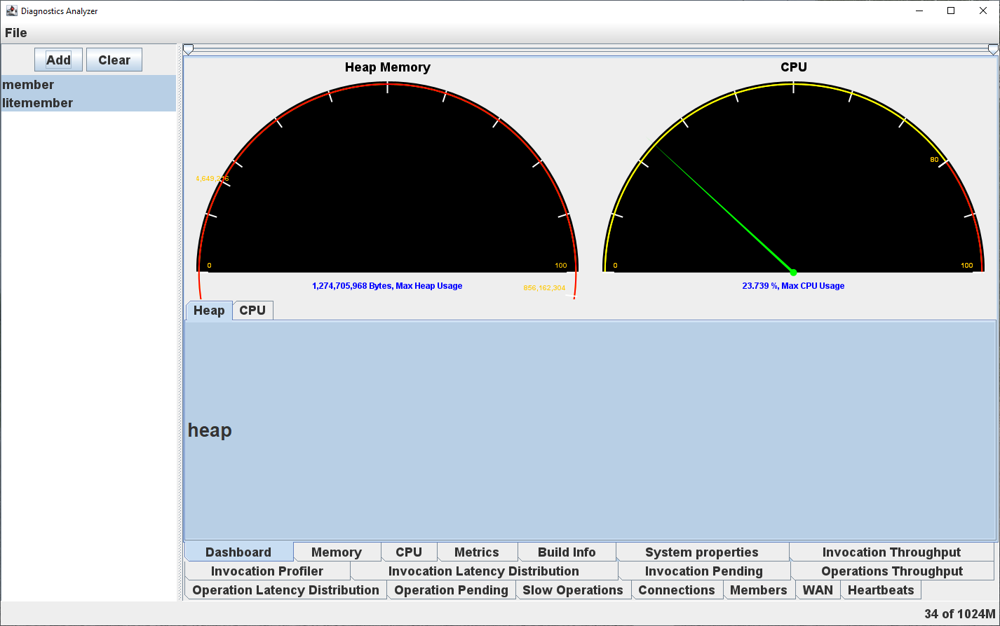

# Diagnostics Analyzer

Analyzes the [collected diagnostics](https://docs.hazelcast.com/hazelcast/latest/maintain-cluster/monitoring#diagnostics) of Hazelcast

----

----

## Launching
- Launch [`com.hazelcast.diagnostics.Main.main(String[])`](./src/main/java/com/hazelcast/diagnostics/Main.java)
- Add VM arguments to avoid `java.lang.IllegalAccessError: [...] java.desktop does not export [...] to unnamed module`
	- Windows
		- `--add-exports java.desktop/com.sun.java.swing.plaf.windows=ALL-UNNAMED`
	- MacOS
		- `--add-exports java.desktop/apple.laf=ALL-UNNAMED`
		- `--add-exports java.desktop/com.apple.laf=ALL-UNNAMED`
